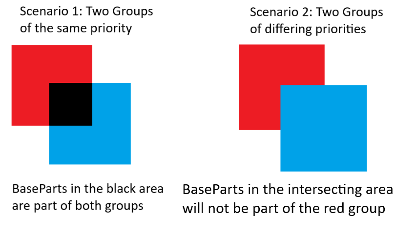

# Usage

## Zones
Zones are static areas in your map, either defined by a part
```lua
QuickBounds.createZoneFromInstance(workspace.ZonePart)
```

or with a cframe, size and shape.
```lua
QuickBounds.createZone(
    CFrame.new(0, 5, 0),
    Vector3.new(10, 10, 10),
    "Box"
)
```

You can also destroy zones by simply calling destroy on them.
```lua
local zone = QuickBounds.createZone(
    CFrame.new(0, 5, 0),
    Vector3.new(10, 10, 10),
    "Box"
)

zone:Destroy()
```

## Groups
Groups are collections of zones, where a zone can be a member of any number of groups.

### Creation
```lua
local group = QuickBounds.createGroup(10)
--you can also assign a different priority later
group:setPriority(5)
```
The number you pass into createGroup is that group's priority, lower priorities will win over higher priorities and the default priority when no number is passed is 100000.



### Adding and Removing Parts
```lua
local group = QuickBounds.createGroup(10)
group:add(workspace.ExamplePart, {belongsTo = players.xyz})
```

To start tracking parts, you need to call group:add like above for any part you want the group to track.
The second argument is your custom data, it can be whatever you want and is also unique to whatever group you add the part to.
You can also naturally add a part to any number of groups.

For a practical example you can take a look at the [Player Addon](https://unityjaeger.github.io/QuickBounds/docs/addons)

To remove a part from a group simply call
```lua
local group = QuickBounds.createGroup(10)
group:remove(workspace.ExamplePart)
```

### Zones and Groups
```lua
local group = QuickBounds.createGroup(10)
local otherGroup = QuickBounds.createGroup(5)

local zone = QuickBounds.createZoneFromInstance(workspace.ZonePart)

zone:watchGroups(group, otherGroup)
```
To make zones part of a group, you call watchGroups like above on a zone.

To remove zones from a group, you call unwatchGroups in the same way:
```lua
local group = QuickBounds.createGroup(10)
local otherGroup = QuickBounds.createGroup(5)

local zone = QuickBounds.createZoneFromInstance(workspace.ZonePart)

zone:watchGroups(group, otherGroup)
zone:unwatchGroups(otherGroup)
```

### Tracking Parts
Instead of tracking parts per zone, parts are tracked per group, meaning if a part enters any zone that is a member of a group, the group will be notified.
```lua
local group = QuickBounds.createGroup()

group:onEntered(function(part: BasePart, zone: QuickBounds.Zone, customData: any?)
    print(part, "entered this group")
end)

group:onExited(function(part: BasePart, zone: QuickBounds.Zone, customData: any?)
    print(part, "exited this group")
end)
```

You can also register as many callbacks as you like.

The first parameter passed to the callback function is the part that entered the group, the second parameter is the zone object as returned by createZone or createZoneFromInstance, where a zone.part field will exist if the zone was created with createZoneFromInstance. The third parameter is the custom data that was registered when adding the part to this group.

Both onEntered and onExited return a cleanup function that will deregister the callback.

## Utility

### Frame Budget
The module lets you define a custom frame budget in seconds, everything that the library does per frame and everything your callbacks do will count towards the remaining frame budget, the default frame budget is 1ms.
```lua
QuickBounds.setFrameBudget(2/1000) --2ms
```

### Helper Functions
isPartInGroup - quickly check if a part is currently inside of a group
```lua
local group = QuickBounds.createGroup()
print(QuickBounds.isPartInGroup(workspace.ExamplePart, group))
```

getGroupsForPart - get all groups that a part is currently inside of
```lua
for _, group in QuickBounds.getGroupsForPart(workspace.ExamplePart) do
    print(group)
end
```

getPartsForGroup - get all parts that are currently inside of the specified group
```lua
local group = QuickBounds.createGroup()
for _, part in QuickBounds.getPartsForGroup(group) do
    print(part)
end
```

## Considerations
- only the center of parts are tracked and their size is not included for calculations, this is important to keep in mind when you have small/flat zones or big parts
- parts are not guaranteed to touch a zone if they skip over the zone between 2 processing frames